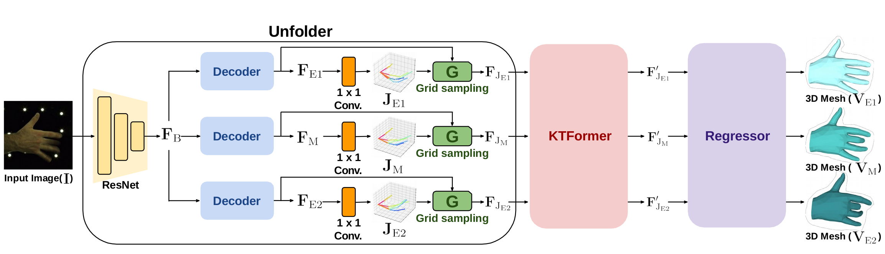

# BlurHand
This repository is an official implementation of the paper **"Recovering 3D Hand Mesh Sequence from a Single Blurry Image: A New Dataset and Temporal Unfolding** (CVPR 2023)". [[arxiv](https://arxiv.org/abs/2303.15417)]



 
<div align="center">
(Left: Blurry input, Right: BlurHandNet output)
</div>

## BlurHand

You can download our BlurHand dataset in the following [**link**](https://drive.google.com/drive/folders/178q3oUQrOIJMKi0KHoRoQmWRGM8JZnMi?usp=share_link).

Instruction on our dataset is available at [**here**](assets/docs/BlurHand.md).


## BlurHandNet

Please follow the below instructions.

1. [**Installation and Dataset preparation**](assets/docs/Installation.md).
2. [**Training the BlurHandNet**](assets/docs/Training.md) (skip the process if you only want to run a pre-trained model).
3. [**Testing**](assets/docs/Testing.md).

## Citation

If our work was helpful for your research, please cite our paper.

```
@inproceedings{oh2023BlurHand,
  title={Recovering 3D Hand Mesh Sequence from a Single Blurry Image: A New Dataset and Temporal Unfolding},
  author={Oh, Yeounguk and Park, JoonKyu and Kim, Jaeha and Moon, Gyeongsik and Lee, Kyoung Mu},
  booktitle={Proceedings of the IEEE Conference on Computer Vision and Pattern Recognition},
  year={2023}
}
```

## Acknowledgement

Our code implementaions are motivated from the below codes. We thank the authors for sharing the awesome repositories.

1. [Hand4Whole_RELEASE](https://github.com/mks0601/Hand4Whole_RELEASE)
2. [maed](https://github.com/ziniuwan/maed)
3. [BasicSR](https://github.com/XPixelGroup/BasicSR)


## Contact
If you have any question, please email `jhkim97s2@gmail.com`.
